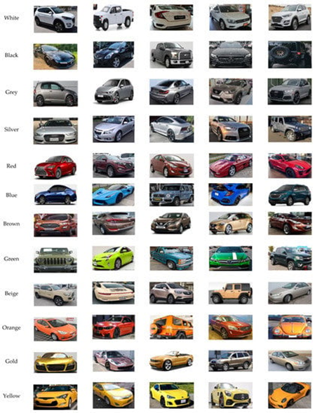

### Data

Download the VCoR dataset from https://www.kaggle.com/datasets/landrykezebou/vcor-vehicle-color-recognition-dataset.
It has 15 classes (15 color), 7.5k train images, 1.5k val images, 1.5k test images. It already has the folder structure used 
by the Torch ImageFolder class. 

### Train a model 

Edit config.py to the set parameters that you want. Lunch train.py. 

### Check Training results

Go in runs/training/ there will be a folder named with the date time when you lunched the training. Results will be in that 
folder. Run plots.py afterward to get subplots.

Example:

Confusion matrix (vertical axis are Labels, horizontal axis are predictions): 

### Inference

Lunch recognize_color.py (TODO) to infer color from an unseen image.
