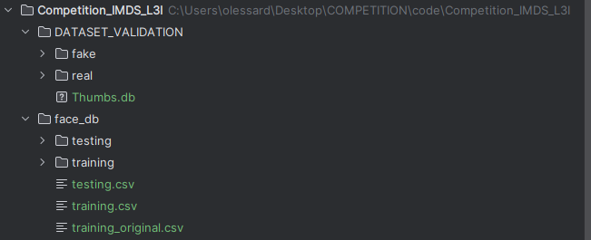

dataset should be located here under the project folder

Experiments:

* baseline 1: DenseNet169, trained with  756 (Real,Fake) pairs.

* Scheme 2: DenseNet169 with attention map, Discriminator applied on fake images, trained with  756 (Real,Fake) pairs.

* Scheme 3: DenseNet169 with attention map, Discriminator applied fake images, contrastive loss used. Trained with  756 (Real,Fake) pairs.

* Scheme 4: DenseNet169 with attention map, Discriminator applied on real and fake images, contrastive loss used. Trained with  756 (Real,Fake) pairs.

* Scheme 5: DenseNet169 with attention map, Discriminator applied fake images, contrastive loss used. Trained with  756 (Real,Fake) pairs, with decoder.

https://docs.google.com/presentation/d/1YORlVgPNP40MqPUP8LUKPfmUDtLKH0hP/edit?usp=sharing&ouid=113876798300744712647&rtpof=true&sd=true